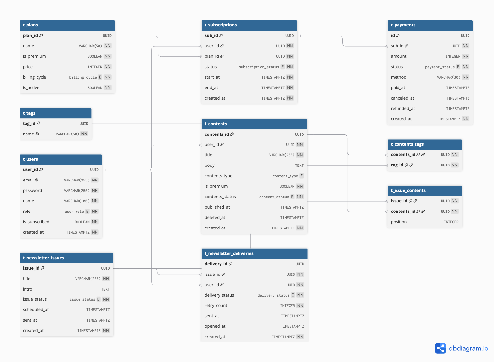

# 데이터 모델 (ERD) 문서

AI 콘텐츠 구독 서비스의 데이터 구조 설명서. 각 테이블의 역할·주요 컬럼·연관관계와 인덱스 전략을 담는다.

## 설계 원칙

- **DBMS**: PostgreSQL 18
- **PK 전략**: 모든 테이블 `uuid` + `DEFAULT uuidv7()`. 시간순으로 정렬되는 UUID라 전역 유일성·ID 비추측성을 유지하면서도 B-tree 인덱스 단편화를 줄인다. (PG 17 이하라면 앱단 라이브러리로 생성)
- **enum 컬럼**: 상태값은 native `ENUM` 타입(`CREATE TYPE`)으로 정의해 무결성을 DB가 강제.
- **시간 컬럼**: 전부 `timestamptz`(타임존 인식).
- **도메인 분리**: 데이터를 세 도메인으로 나눈다 — ① 회원·구독·결제, ② 콘텐츠, ③ 발송.
- **핵심 규칙**: 콘텐츠 도메인과 구독 도메인이 만나는 지점 = **"프리미엄 콘텐츠는 유효 구독자만 열람"**(게이팅). 서비스의 단일 핵심 비즈니스 로직.

### ERD 다이어그램



### 엔티티 한눈에 보기

| 도메인 | 테이블 | 역할 |
|--------|--------|------|
| 회원·구독·결제 | `users` | 회원/관리자 계정, 뉴스레터 수신 여부 |
| | `plans` | 요금제(Free/Premium) 정의 |
| | `subscriptions` | 사용자의 구독 이력·상태 |
| | `payments` | 구독에 대한 결제 기록(Mock) |
| 콘텐츠 | `contents` | AI 소식/가이드 게시글, 무료/프리미엄 구분 |
| | `tags` | 분류 태그 |
| | `content_tags` | 콘텐츠 ↔ 태그 (M:N) |
| 발송 | `newsletter_issues` | 발송 단위(뉴스레터 호) |
| | `issue_contents` | 호 ↔ 콘텐츠 큐레이션 (M:N) |
| | `newsletter_deliveries` | 사용자별 발송/오픈 이력 |

---

## 1. 회원·구독·결제 도메인


### `users`
회원과 관리자를 모두 담는 계정 테이블.

| 컬럼 | 타입 | 설명 |
|------|------|------|
| `id` | uuid (PK) | `uuidv7()` |
| `email` | varchar (UK) | 로그인 식별자, 중복 불가 |
| `password_hash` | varchar | 해싱된 비밀번호 |
| `name` | varchar | 표시 이름 |
| `role` | user_role | `member` / `admin` (권한 분기) |
| `newsletter_subscribed` | boolean | 발송 대상 여부(default true, 수신거부 표현) |
| `created_at` | timestamptz | 가입 시각 |

`role`로 콘텐츠 작성·발송 같은 관리자 전용 기능의 접근을 통제한다. `newsletter_subscribed`는 "전체 구독 회원" 발송 대상 집합을 정의한다.

### `plans`
구독 요금제. 본 MVP에서는 Free/Premium 두 가지.

| 컬럼 | 타입 | 설명 |
|------|------|------|
| `id` | uuid (PK) | |
| `name` | varchar | `Free` / `Premium` |
| `is_premium` | boolean | 프리미엄 권한 부여 여부(게이팅 판정용) |
| `price` | integer | 가격(KRW) |
| `billing_cycle` | varchar | `monthly` / `yearly` |
| `is_active` | boolean | 판매 중 여부 |

요금제를 별도 테이블로 둬, 가격·주기 변경이나 요금제 추가가 스키마 변경 없이 데이터로 가능하다.

### `subscriptions`
사용자가 어떤 플랜을 언제부터 언제까지 구독했는지의 **이력과 현재 상태**.

| 컬럼 | 타입 | 설명 |
|------|------|------|
| `id` | uuid (PK) | |
| `user_id` | uuid (FK→users) | 구독 주체 |
| `plan_id` | uuid (FK→plans) | 구독 플랜 |
| `status` | subscription_status | `active` / `canceled` / `expired` / `past_due` |
| `start_at` | timestamptz | 구독 시작 |
| `end_at` | timestamptz | 만료 시점(프리미엄 유효성 판정의 핵심) |
| `created_at` | timestamptz | |

> **설계 의도**: 구독을 users에 컬럼으로 붙이지 않고 분리한 이유는, 한 사용자가 시간에 따라 여러 구독 이력을 갖고 상태가 전이되기 때문이다. "지금 유효한가"는 `status='active' AND end_at > now()` 단일 조건으로 판정한다.

### `payments`
구독에 대한 결제 기록. 실제 PG 연동은 Mock이며, 인터페이스 교체 가능하도록 자리만 마련.

| 컬럼 | 타입 | 설명 |
|------|------|------|
| `id` | uuid (PK) | |
| `subscription_id` | uuid (FK→subscriptions) | 결제 대상 구독 |
| `amount` | integer | 결제 금액(KRW) |
| `currency` | varchar | 통화(default KRW) |
| `status` | payment_status | `paid` / `failed` / `refunded` |
| `method` | varchar | `card` / `mock` |
| `paid_at` | timestamptz | 결제 완료 시각 |
| `created_at` | timestamptz | |

> Free 구독은 결제가 없으므로 payments를 생성하지 않고, Premium 구독만 결제 레코드를 만든다.

---

## 2. 콘텐츠 도메인


### `contents`
AI 소식·가이드 게시글. 무료/프리미엄과 발행 상태를 가진다.

| 컬럼 | 타입 | 설명 |
|------|------|------|
| `id` | uuid (PK) | |
| `author_id` | uuid (FK→users) | 작성 관리자 |
| `title` | varchar | 제목 |
| `body` | text | 본문 |
| `content_type` | content_type | `news` / `guide` |
| `is_premium` | boolean | **프리미엄 게이팅 분기 플래그** |
| `status` | content_status | `draft` / `published` |
| `published_at` | timestamptz | 발행 시각(아카이브 정렬 기준) |
| `created_at` | timestamptz | |

`is_premium=true`인 콘텐츠의 본문은 유효 구독자만 열람할 수 있다(게이팅). `status='published'`인 글만 일반 사용자에게 노출된다.

### `tags` / `content_tags`
콘텐츠 분류를 태그로 일원화(별도 categories 테이블 미사용).

`content_tags`는 콘텐츠와 태그의 **다대다(M:N)** 관계를 잇는 조인 테이블이며, PK는 `(content_id, tag_id)` 복합키.

| 테이블 | 컬럼 | 설명 |
|--------|------|------|
| `tags` | `id` uuid (PK) / `name` varchar (UK) | 태그명 중복 불가 |
| `content_tags` | `content_id` uuid (FK) / `tag_id` uuid (FK) | 복합 PK |

---

## 3. 발송 도메인

### `newsletter_issues`
한 번에 발송되는 뉴스레터 단위(호). 예약·발송중 상태를 표현한다.

| 컬럼 | 타입 | 설명 |
|------|------|------|
| `id` | uuid (PK) | |
| `title` | varchar | 호 제목 |
| `intro` | text | 편집자 소개글 |
| `status` | issue_status | `draft` / `scheduled` / `sending` / `sent` |
| `scheduled_at` | timestamptz | 예약 발송 시각 |
| `sent_at` | timestamptz | 실제 발송 완료 시각 |
| `created_at` | timestamptz | |

`sending` 상태가 있어, 대량 발송이 진행 중인 호를 구분할 수 있다(비동기 처리 전제).

### `issue_contents`
뉴스레터 호에 어떤 콘텐츠들이 어떤 순서로 담기는지(큐레이션). 호 ↔ 콘텐츠 **M:N**.

| 컬럼 | 타입 | 설명 |
|------|------|------|
| `issue_id` | uuid (FK→newsletter_issues) | |
| `content_id` | uuid (FK→contents) | |
| `position` | integer | 호 내 노출 순서 |

### `newsletter_deliveries`
**사용자별 발송/오픈 이력.** (호 × 전체 구독 회원)이라 가장 큰 테이블이며, 비동기·배치 발송과 추적의 핵심.

| 컬럼 | 타입 | 설명 |
|------|------|------|
| `id` | uuid (PK) | |
| `issue_id` | uuid (FK→newsletter_issues) | 발송된 호 |
| `user_id` | uuid (FK→users) | 수신자 |
| `status` | delivery_status | `pending` / `sent` / `opened` / `bounced` / `failed` |
| `attempt_count` | smallint | 재시도 횟수 |
| `sent_at` | timestamptz | 발송 시각 |
| `opened_at` | timestamptz | 오픈 시각 |
| `created_at` | timestamptz | |

> **설계 의도**: `pending` 상태가 비동기 발송의 핵심이다. 호를 발송하면 즉시 메일을 쏘는 게 아니라, 대상자 수만큼 `pending` 레코드를 먼저 적재(fan-out)하고 배치 워커가 이후 처리한다. 이력을 별도 테이블에 행 단위로 남겨, 오픈율·실패율 같은 지표로 확장할 수 있다.

---

## 4. 관계 요약

| 관계 | 종류 | 의미 |
|------|------|------|
| users → subscriptions | 1:N | 한 사용자가 여러 구독 이력 |
| plans → subscriptions | 1:N | 한 플랜을 여러 사용자가 구독 |
| subscriptions → payments | 1:N | 한 구독에 여러 결제(갱신 등) |
| users → contents | 1:N | 관리자가 여러 콘텐츠 작성 |
| contents ↔ tags | M:N | `content_tags` 경유 |
| newsletter_issues ↔ contents | M:N | `issue_contents` 경유(큐레이션) |
| newsletter_issues → newsletter_deliveries | 1:N | 한 호가 다수 수신자에게 fan-out |
| users → newsletter_deliveries | 1:N | 한 사용자가 여러 호를 수신 |

---

## 5. 인덱스 전략

PostgreSQL은 PK/UNIQUE 외 FK 컬럼에 인덱스를 자동 생성하지 않으므로, 조회 패턴에 맞춰 명시적으로 설계한다. (실행 DDL은 `indexes.sql` 참조)

### 5-1. 접근 제어 (프리미엄 게이팅)

| 인덱스 | 대상 | 목적 |
|--------|------|------|
| `subscriptions(user_id, end_at) WHERE status='active'` | 부분 인덱스 | **유효 구독 판정 hot path**. 만료/취소 행을 색인에서 제외해 작고 빠르게 유지 |
| `UNIQUE subscriptions(user_id) WHERE status='active'` | 부분 유니크 | 1인 1활성구독 보장. 동시성 버그로 인한 중복 활성 차단 |
| `subscriptions(end_at) WHERE status='active'` | 부분 인덱스 | 만료 배치가 지난 구독을 expired로 전환 시 스캔 |
| `contents(published_at DESC) WHERE status='published'` | 부분 인덱스 | 아카이브 목록(발행글 최신순) |
| `content_tags(tag_id, content_id)` | 복합 | 태그별 콘텐츠 탐색(역방향) |

게이팅 판정 쿼리:
```sql
SELECT 1 FROM subscriptions
WHERE user_id = $1 AND status = 'active' AND end_at > now()
LIMIT 1;
```
`is_premium`은 boolean(저카디널리티)이라 단독 인덱스 효용이 낮다. 목록은 발행 인덱스로 가져오고, 본문 접근 시점에만 위 게이팅 인덱스로 권한을 확인하는 설계가 효율적이다.

### 5-2. 발송 이력 (대량·배치·비동기)

| 인덱스 | 대상 | 목적 |
|--------|------|------|
| `UNIQUE newsletter_deliveries(issue_id, user_id)` | 유니크 | **멱등성**. fan-out 재시도 시 중복 발송 차단 |
| `newsletter_deliveries(issue_id, id) WHERE status='pending'` | 부분 인덱스 | **배치 워커 큐**. 발송 진행될수록 인덱스가 작아짐 |
| `newsletter_deliveries(issue_id, status)` | 복합 | 이슈별 발송 통계(상태별 집계) |
| `newsletter_deliveries(user_id, sent_at DESC)` | 복합 | 사용자별 수신 이력 |
| `users(id) WHERE newsletter_subscribed=true` | 부분 인덱스 | 발송 대상 산출 |

배치 워커는 잠금 경합을 피하기 위해 `SKIP LOCKED`로 미발송 건을 가져온다:
```sql
SELECT id FROM newsletter_deliveries
WHERE issue_id = $1 AND status = 'pending'
ORDER BY id
FOR UPDATE SKIP LOCKED
LIMIT 500;
```

멱등 fan-out:
```sql
INSERT INTO newsletter_deliveries (issue_id, user_id, status)
SELECT $1, id, 'pending' FROM users WHERE newsletter_subscribed = true
ON CONFLICT (issue_id, user_id) DO NOTHING;
```

### 5-3. 조인용 FK 인덱스
`subscriptions(plan_id)`, `payments(subscription_id)`, `contents(author_id)`, `issue_contents(content_id)` — 조인/필터에 쓰이는 FK에 명시적 인덱스를 둔다.

---

## 6. 핵심 흐름 두 가지

**프리미엄 게이팅** — 사용자가 프리미엄 콘텐츠 본문을 요청하면, `subscriptions`에서 활성 구독 유효성을 확인(5-1 인덱스)하고, 유효하지 않으면 본문 대신 미리보기/안내를 반환한다.

**비동기 뉴스레터 발송** — 관리자가 호를 발송하면 ① 대상 구독 회원 수만큼 `newsletter_deliveries`에 `pending` 적재(fan-out), ② 배치 워커가 `SKIP LOCKED`로 pending을 가져와 발송 후 `sent`로 갱신, ③ 오픈 트래킹으로 `opened` 기록. 이력이 행 단위로 남아 발송 결과를 집계할 수 있다.

---

## 7. 확장 메모 (범위 외)
- 발송량 증가 시 `newsletter_deliveries`를 `issue_id` 또는 월별 파티셔닝, 오래된 이력은 아카이브 분리.
- payments는 현재 Mock이며, 실제 PG 연동은 인터페이스 교체로 대응.
- `past_due`, 토큰 리프레시, 스케줄러 등은 구조만 남기고 구현 범위에서 제외.

